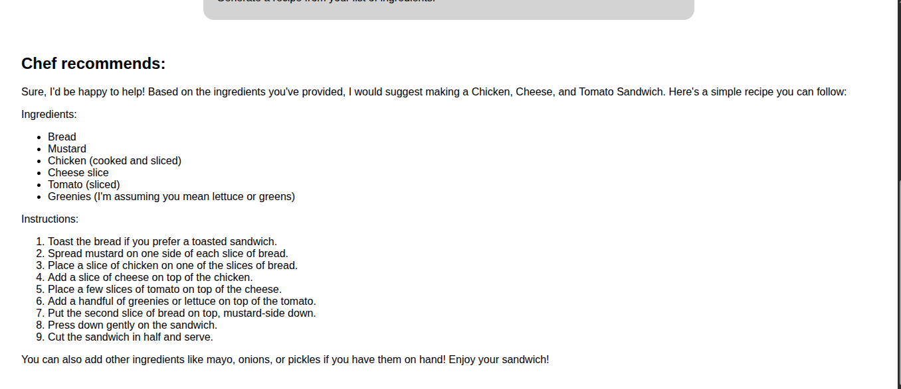

# Chef-AI
This a simple React project that takes  list of ingredients from the user and generates a custom recipe using AI api

AI Api used from [hugging-face](https://huggingface.co/)

### features :
 *  fast response time
 * generates recipe dynamically
 * any custom recipe by user's choice

### Taking ingredients from user
 

### Generating recipe response 

